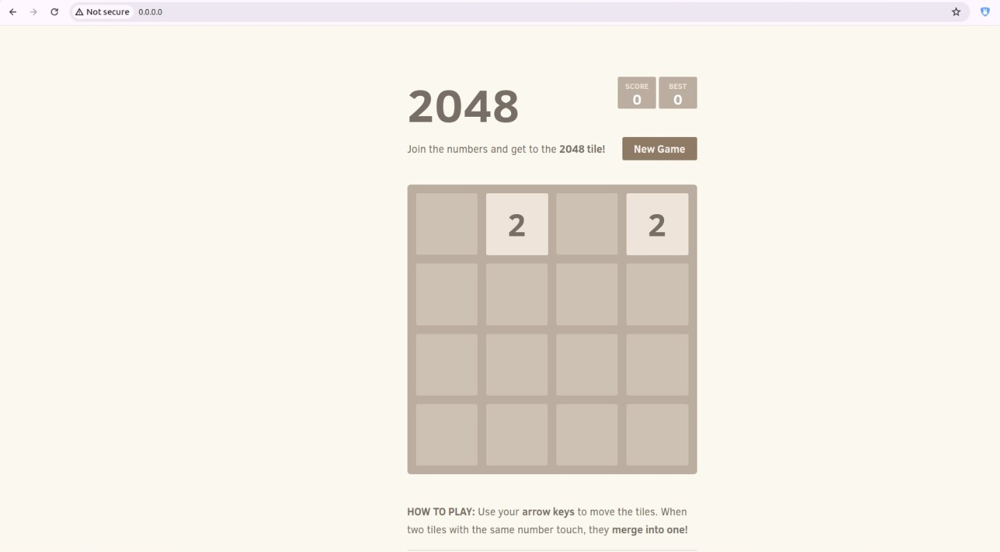
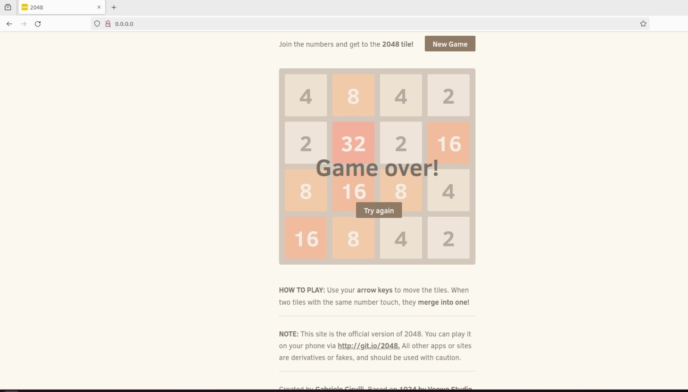

# 2048 Game

2048 is a single-player sliding block puzzle game designed by Italian web developer Gabriele Cirulli. The game's objective is to slide numbered tiles on a grid to combine them to create a tile with the number 2048.

# Now we are deoplying this 2048-Game via docker tool...

## Firstly install docker in your system

```bash
sudo apt-get install docker.io
```

### Give all permissions to run the docker.

Let start-->>

### To deploy this project run those commands on terminal

```bash
mkdir 2048-game
cd 2048-game/
```

#### Let make the Dockerfile for build the project.

```bash
vim Dockerfile
```

```bash
Dockerfile content-->>

ubuntu@ip-172-31-94-106:~/2048-game$ cat Dockerfile
FROM ubuntu:22.04

RUN  apt-get update
RUN  apt-get install -y nginx zip curl

RUN echo "daemon off;" >>/etc/nginx/nginx.conf
RUN curl -o /var/www/html/master.zip -L https://codeload.github.com/gabrielecirulli/2048/zip/master
RUN cd /var/www/html/ && unzip master.zip && mv 2048-master/* . && rm -rf 2048-master master.zip

EXPOSE 80

CMD ["/usr/sbin/nginx","-c", "/etc/nginx/nginx.conf"]

```

Note:- this project is only run on port or expose on localhost:80

Run these commands on terminal...

```bash
docker build -t 2048-game .
```

now check the current images

```bash
docker run -d -p 80:80 --name=2048-game 2048-game
```

now check the running container..

### Open the web browser and enter the ip 0.0.0.0:80(localhost)

# RESULT :-


